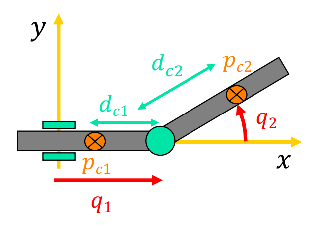

# Robot Manipulator Dynamics
This repository contains Matlab scripts used to compute Euler-Lagrange dynamic models of a large number of robot manipulators.

Euler-Lagrange Dynamics:  ```M(q)*ddq + c(q,dq) + g(q) = u```

**_dynamics_functions_** contains all the functions needed to compute and display the Euler Lagrange dynamics.
In particular:
```
- moving_frame.m
- kinetic_energy.m
- inertia_matrix.m
- centrifugal_coriolis.m
- factorization.m
- potential_energy.m
- print_dynamics.m
```

Make sure to setup the Matlab path correctly in order to use this library, or alternatively copy and paste it at the end of your scripts.

 
 
#### Example: PR planar robot
Input data:
```
%% ROBOT DATA
sigma = [1 0];          % 0 if revolute, 1 if prismatic
r{1} = [q(1); 0; 0];
r{2} = [l(2)*sin(q(2)); -l(2)*cos(q(2)); 0];
gravity = [0; -g0; 0];
```



Output:
```
~ Robot Manipulator Dynamics ~

  Developed by Giuseppe Sensolini (github: @giusenso)
  May 2020
  Brief: algorithms for computing Euler-Lagrange dynamics


robot: PR

=== MOVING FRAME ================================
rcm01 =
q1 - d1
      0
      0
 
w1 =
0
0
0
 
vcm1 =
dq1
  0
  0
 
Tcm(1) = (dq1^2*m1)/2
 
__________________________________

rcm02 =
q1 + d2*sin(q2)
    -d2*cos(q2)
              0
 
w2 =
  0
  0
dq2
 
vcm2 =
dq1 + d2*dq2*cos(q2)
      d2*dq2*sin(q2)
                   0
 
Tcm(2) = (m2*d2^2*dq2^2)/2 + m2*cos(q2)*d2*dq1*dq2 + (m2*dq1^2)/2 + (I2zz*dq2^2)/2
 
=== KINETIC ENERGY ==============================

T = (I2zz*dq2^2)/2 + (dq1^2*m1)/2 + (dq1^2*m2)/2 + (d2^2*dq2^2*m2)/2 + d2*dq1*dq2*m2*cos(q2)
 
=== INERTIA MATRIX ==============================

M(q) = 
[      m1 + m2,  d2*m2*cos(q2)]
[d2*m2*cos(q2), m2*d2^2 + I2zz]
 
=== Christhoffel symbols ========================
C(1) = 
[0,              0]
[0, -d2*m2*sin(q2)]
 
C(2) = 
[0, 0]
[0, 0]
 
=== CORIOLIS and CENTRIFUGAL ====================

c(q,dq) = 
-d2*dq2^2*m2*sin(q2)
                   0
 
S(q,dq) = 
[0, -d2*dq2*m2*sin(q2)]
[0,                  0]
 
=== POTENTIAL ENERGY ============================

U = -d2*g0*m2*cos(q2)
 
=== GRAVITY =====================================

g(q) = 
               0
d2*g0*m2*sin(q2)
 
=== ROBOT DYNAMICS ==============================

  - d2*m2*sin(q2)*dq2^2 + ddq1*(m1 + m2) + d2*ddq2*m2*cos(q2) == u1
ddq2*(m2*d2^2 + I2zz) + d2*ddq1*m2*cos(q2) + d2*g0*m2*sin(q2) == u2
```
